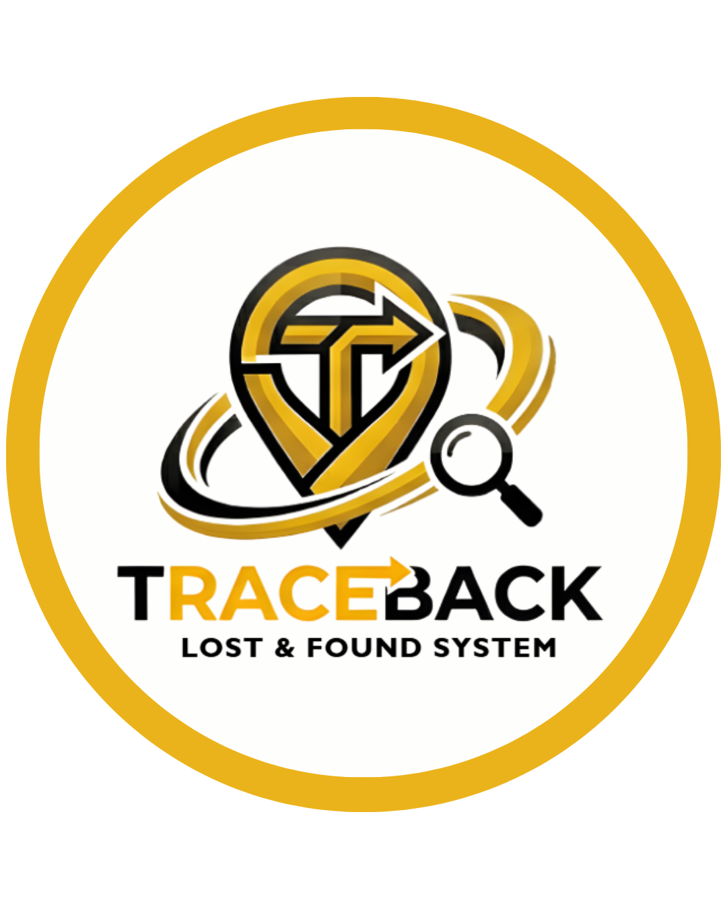

<div align="center">
  
</div>

<br>

<div align="center">

  <a href="https://nodejs.org/">
    
  </a>

  <a href="https://developer.mozilla.org/en-US/docs/Web/JavaScript">
    
  </a>

  <a href="https://tailwindcss.com/">
    
  </a>

</div>

---

# Traceback: TIPQC Lost-and-Found System

A relational DBMS engineered to overhaul the TIPQC Office of Student Affairs (OSA) asset recovery process. Traceback eliminates information silos by replacing opaque logs with a normalized relational schema, ensuring high-integrity transparency and secure access control.

## 📌 The Problem: Data Opacity & Accountability
The current TIPQC system limits student visibility to item photos and IDs, while lacking a secure method to track the chain of custody. Critical metadata—such as discovery locations, receiver identities, and claim timestamps—is abstracted. Traceback solves this by providing a verifiable audit trail for every item.

## 👥 Role-Based Access Control (RBAC)
Traceback utilizes a centralized authentication system to bifurcate user experiences based on permissions:

### 1. Administrative Portal (OSA Role)
* **Write & Update Privileges:** Authorized personnel can register new items, update statuses, and link claimants to records.
* **Privacy Management:** Controls the visibility of sensitive student data on the public dashboard.

### 2. Transparency Dashboard (Student Role)
* **Live Status Tracking:** Real-time visibility into whether an item is available, claimed, or approaching the 30-day discard threshold.
* **Secure Verification:** Uses the student’s actual student ID to match identity records during the claiming process.

---

## ⚙️ Technical Architecture

### Authentication Layer
The system implements a `Users` table to manage security:
* **Roles:** `Admin/Staff` vs. `Student`.
* **Security:** Ensures that "Delete" and "Update" operations are restricted to authorized OSA accounts, preventing unauthorized data manipulation.

### Schema Normalization
Built on **MySQL**, the database architecture uses normalized schemas to:
* Eliminate data redundancy.
* Provide an immutable audit trail from initial intake to final claim or disposal.

---

## 🛠 Testing & Future-Scalability
* **Auth Validation:** Testing login redirects and permission-gating for OSA vs. Student views. An OSA Admin account has the only permission to create, update, and delete records.
* **CRUD Integrity:** Verified via mock scenarios tracking items from discovery through the item life cycle.
* **Future Expansion:** Potential for multi-factor authentication (MFA) and integration with the TIPQC institutional login API.
* **Advanced Heuristic Search:** Implementing keyword-based filtering (e.g., "blue wallet", "Room 402") to improve item discoverability.
* **Image Expansion:** Supporting multi-angle photo uploads to assist in visual verification.

## 💻 Developer Team
```
const developerTeam = [
  {
    name: "Ross Andrew Bulaong",
    profile: "https://github.com/BigDrewChicken"
  },
  {
    name: "Anthony Losaria",
    profile: "https://github.com/AntonLosaria"
  },
  {
    name: "Borge Momo",
    profile: "https://github.com/rudolfed"
  },
  {
    name: "Joshua Paul Pios",
    profile: "https://github.com/piosjoshua"
  },
  {
    name: "Jamie Rose Kia Reyes",
    profile: "https://github.com/jamierosereyes"
  }
];

```

## 😁 Fun Fact
```
The name Traceback comes from a core concept in programming.

In coding, a "traceback" is the error report you see when something goes wrong. It “traces back” through the sequence of function calls that led to the error, showing where the issue started and how it propagated.

We borrowed this idea for the system’s identity:

In a real lost-and-found system, every item also has a “history trail”:

> Where was it found?
> Who handled it?
> When was it claimed or discarded?

So just like a programming traceback reveals the origin of a bug, our system Traceback reveals the full journey of an item—from discovery to resolution.

```
---
**Developed for the TIPQC Office of Student Affairs.**

